# AniSync

<p align="center">
  
</p>

<p align="center">
  <strong>A native Android client for AniList — track your anime and manga the way you want</strong>
</p>

<p align="center">
  <a href="#features">Features</a> &middot;
  <a href="#screenshots">Screenshots</a> &middot;
  <a href="#tech-stack">Tech Stack</a> &middot;
  <a href="#getting-started">Getting Started</a> &middot;
  <a href="#documentation">Documentation</a> &middot;
  <a href="#contributing">Contributing</a>
</p>

<p align="center">
  <a href="https://www.android.com/"></a>
  <a href="https://developer.android.com/about/versions/oreo/"></a>
  <a href="https://kotlinlang.org/"></a>
  <a href="https://developer.android.com/jetpack/compose"></a>
  <a href="https://developer.android.com/studio/releases/platforms"></a>
  <a href="https://developer.android.com/studio/releases/build-tools"></a>
  <a href="LICENSE"></a>
</p>

<p align="center">
  <a href="https://github.com/Marco-9456/AniSync/releases"></a>
  <a href="https://github.com/Marco-9456/AniSync/releases/latest"></a>
  <a href="https://f-droid.org/packages/com.anisync.android/"></a>
  <a href="https://github.com/Marco-9456/AniSync/stargazers"></a>
</p>

<p align="center">
  <a href="https://ko-fi.com/marco_9456"></a>
  <a href="https://github.com/sponsors/Marco-9456"></a>
</p>

---

## Overview

AniSync is a native Android app for [AniList.co](https://anilist.co) — the anime and manga tracking platform. It provides a beautiful, **offline-first** experience for managing your watchlist, discovering new content, and staying connected with the anime community.

The app covers everything from basic progress tracking to advanced features like home screen widgets, forum discussions, and detailed statistics.

> [!NOTE]
> AniSync is not affiliated with AniList. It's a third-party client built for the AniList community.

---

## :sparkles: Why AniSync

- **Offline-First** — Your library and data work without an internet connection, syncing when you're back online.
- **Beautiful UI** — Modern Material 3 design with smooth animations and dynamic theming.
- **Smart Notifications** — Know exactly when your favorite shows air, plus stay updated on forum activity.
- **Home Screen Widgets** — Quick access to your anime schedule right from your launcher.
- **Privacy-Focused** — Your credentials are encrypted locally using AES-256-GCM.

---

## Features

### :books: Library Management

Track your anime and manga with full flexibility. Choose from multiple statuses (Watching, Planning, Completed, Dropped, Paused, Repeating), rate your entries on a scale, add personal notes, and organize everything into custom lists. Sort by title, progress, score, airing date, or last updated — ascending or descending.

### :mag: Discovery & Search

Browse what's trending, what's popular this season, upcoming releases, and titles marked TBA. The advanced search lets you filter by 18 genres, release year, season, format (TV, Movie, OVA, ONA, Special, Music), and airing status. Find exactly what you're looking for.

### :movie_camera: Media Details

Every anime and manga page gives you the full picture. See cover art and banners, read descriptions, view episode/chapter counts, and check community scores. Dive deeper with character casts and their voice actors, staff information (directors, studios, producers), and related media (sequels, prequels, side stories).

Watch trailers directly in the app using the built-in video player. Browse community reviews and recommendations, then explore streaming links to find where to watch.

### :performing_arts: Character & Staff Browser

Characters and staff members have their own dedicated pages. View parsed biographies with spoiler handling, key attributes, and media appearances. Filter voice actors by language to find your preferred dub.

### :speech_balloon: Forum

Engage with the AniList community through full forum integration. Browse threads by category, read discussions with nested replies, and participate with markdown support. Like posts, bookmark threads for later, and subscribe to get notified of new replies.

### :bar_chart: Statistics

Get detailed insights into your anime and manga habits. See total time watched, episodes completed, chapters read, and mean scores. Explore breakdowns by genre, format, score distribution, and release year.

### :wrench: Home Screen Widgets

Access your anime schedule without opening the app. Multiple widget types show upcoming episodes with countdown timers, today's airing timeline, a 7-day calendar view, or trending anime at a glance. Configure each widget to show your personal list or all anime.

### :bell: Notification System

Never miss an episode. AniSync sends two-tier notifications — an advance alert 12 hours before air time, then an imminent reminder 2 hours before. Planning list shows? Get notified when they premiere. Forum notifications keep you updated on replies, mentions, and subscriptions.

---

## :camera: Screenshots

<p align="center">
  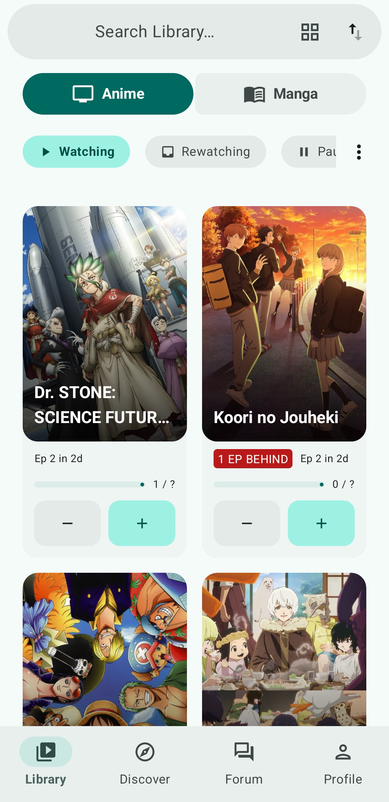
  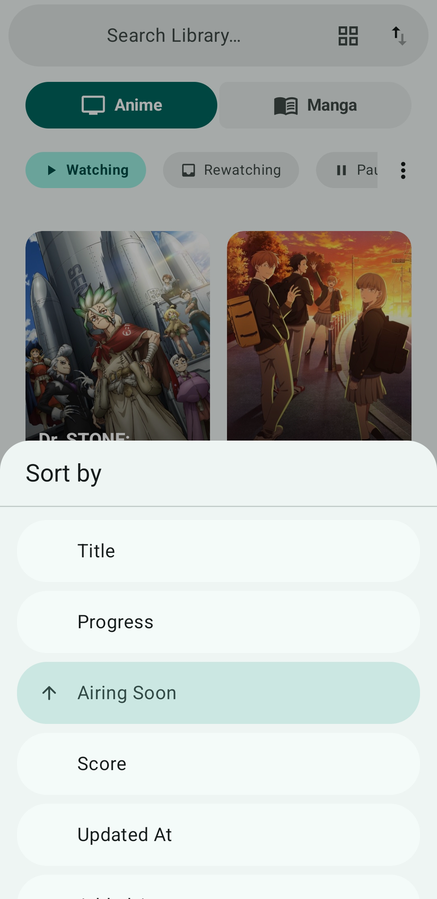
  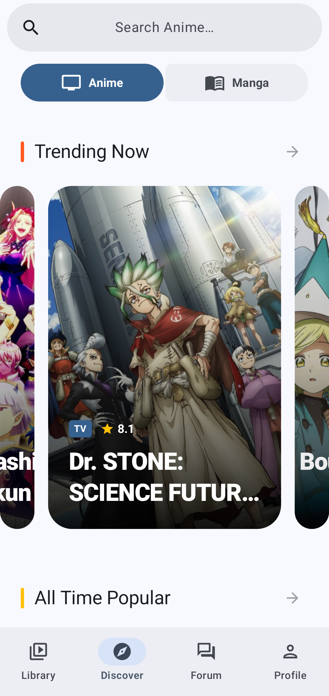
  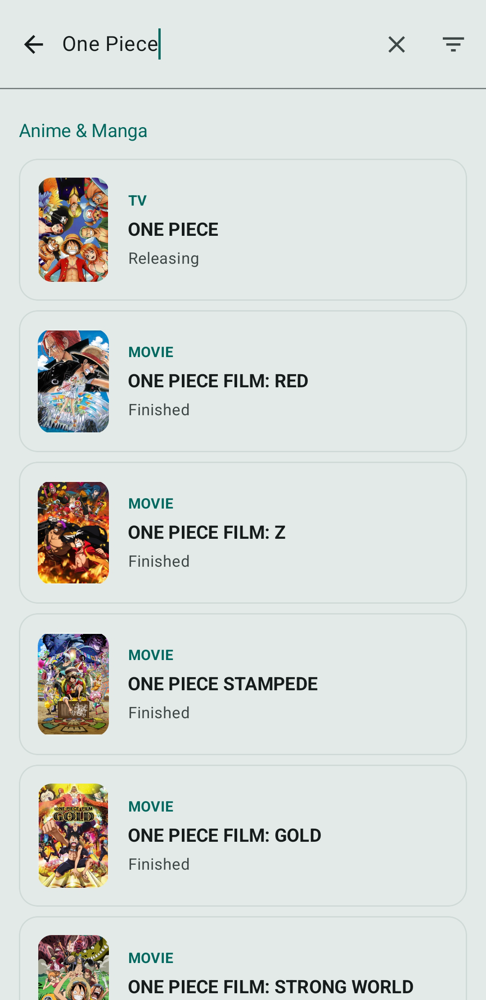
  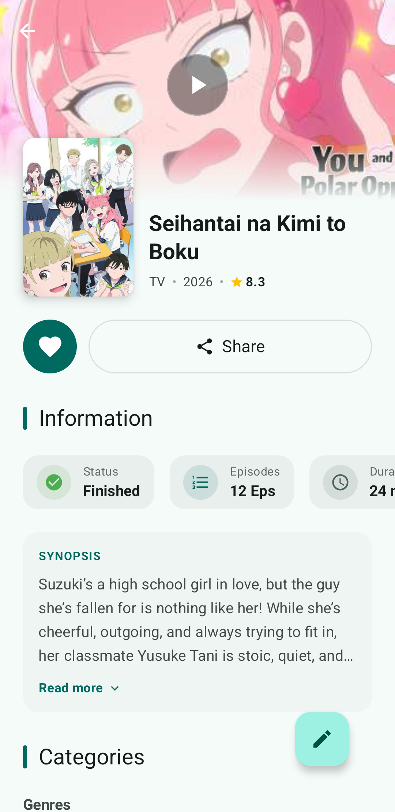
  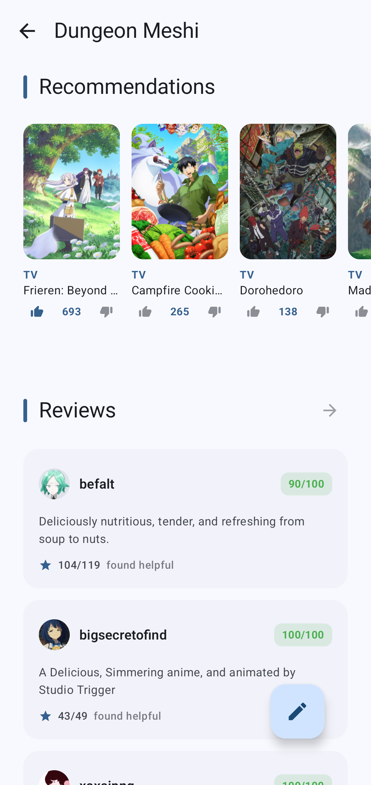
  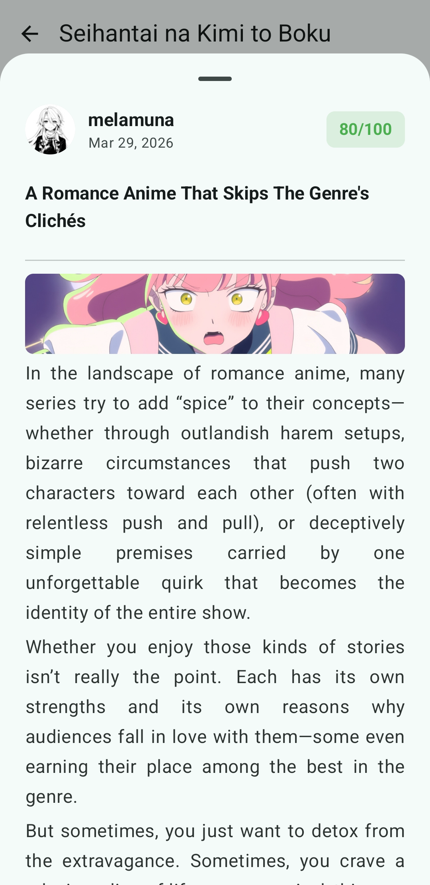
  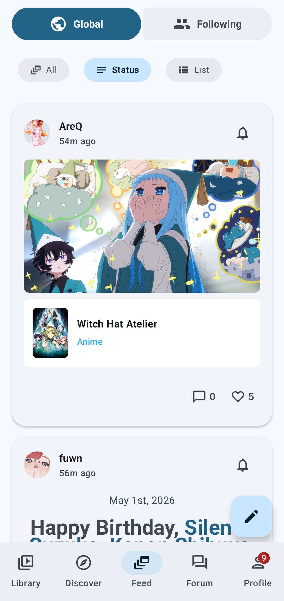
  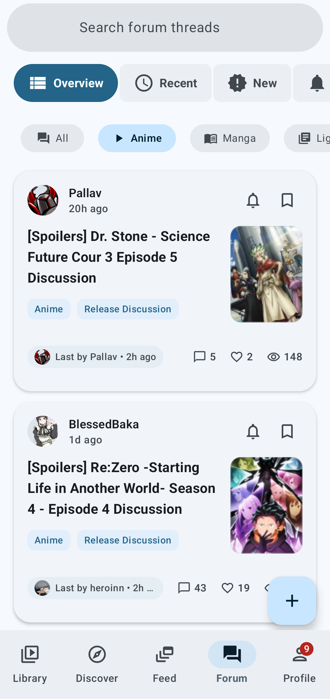
  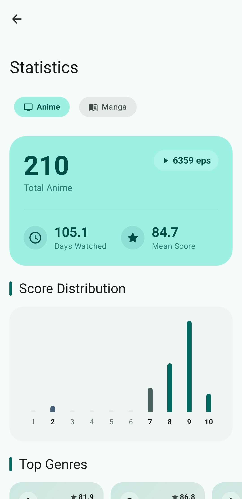
  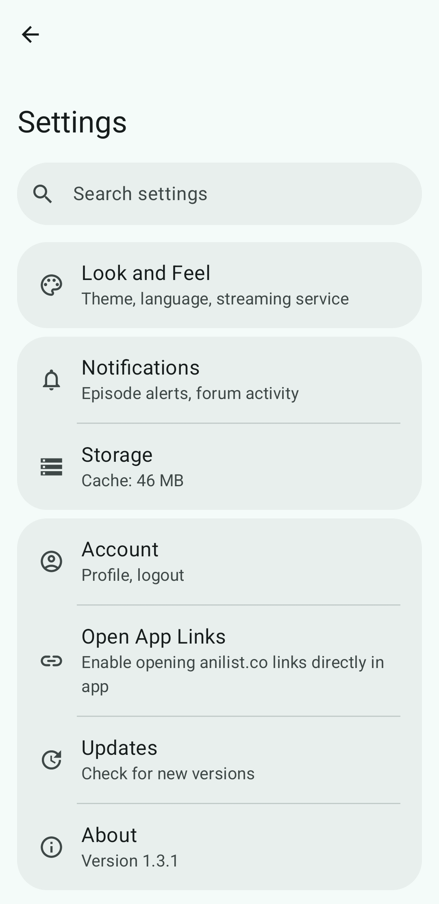
  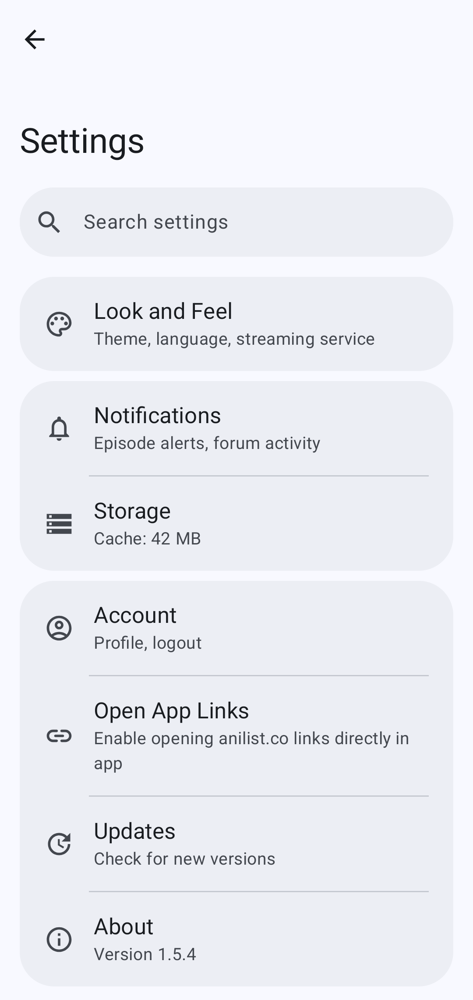
</p>

---

## Tech Stack

| Category | Technology |
| --- | --- |
| **Language** | Kotlin 2.2.21 |
| **UI Framework** | Jetpack Compose with Material 3 |
| **Architecture** | MVVM + Clean Architecture (Use Cases) |
| **Dependency Injection** | Hilt / Dagger |
| **Navigation** | Navigation Compose (Type-safe routes) |
| **Networking** | Apollo GraphQL 4.x |
| **Local Database** | Room with KSP |
| **Theming** | MaterialKolor (dynamic palette styles & seed colors) |
| **Image Loading** | Coil |
| **Video Playback** | ExoPlayer with custom Material 3 UI |
| **Background Work** | WorkManager |
| **Widgets** | Jetpack Glance |
| **Serialization** | Kotlinx Serialization |
| **Security** | EncryptedSharedPreferences (AES-256-GCM) |
| **Min SDK** | 26 (Android 8.0 Oreo) |
| **Target SDK** | 36 (Android 16) |

---

## Getting Started

### Prerequisites

- Android Studio Ladybug (2024.2.1) or newer
- JDK 17
- Android SDK with API 26+

### Building the Project

1. Clone the repository:
```bash
git clone https://github.com/Marco-9456/AniSync.git
cd AniSync
```

2. Open in Android Studio and wait for Gradle sync to complete.

3. Run the app on a device or emulator (API 26+).

> [!TIP]
> You don't need any API keys or additional configuration. The app uses AniList's public GraphQL API and handles authentication via OAuth.

### Build Variants

| Variant | Package ID | Description |
| --- | --- | --- |
| `debug` | `com.anisync.android.debug` | Development build with debug features |
| `stable` | `com.anisync.android` | Production build with ProGuard |

> [!NOTE]
> Both variants can be installed side-by-side for testing.

---

## Documentation

Comprehensive documentation lives in the `docs/` folder:

| Document | Description |
| --- | --- |
| [ARCHITECTURE.md](docs/ARCHITECTURE.md) | System architecture, patterns, and layer responsibilities |
| [DATABASE.md](docs/DATABASE.md) | Room database schema, migrations, and caching strategy |
| [API.md](docs/API.md) | GraphQL integration, authentication, and API reference |
| [NAVIGATION.md](docs/NAVIGATION.md) | Screen flows, navigation graph, and deep links |
| [WIDGETS.md](docs/WIDGETS.md) | Widget architecture and notification system |
| [CONTRIBUTING.md](docs/CONTRIBUTING.md) | Contribution guidelines and code style |
| [CHANGELOG.md](docs/CHANGELOG.md) | Version history and release notes |

### Quick Links

- **Adding a new screen?** → See [NAVIGATION.md](docs/NAVIGATION.md)
- **Changing database schema?** → See [DATABASE.md](docs/DATABASE.md)
- **Understanding data flow?** → See [ARCHITECTURE.md](docs/ARCHITECTURE.md)
- **Working with widgets?** → See [WIDGETS.md](docs/WIDGETS.md)

---

## Project Structure

```
AniSync/
├── app/
│   ├── src/main/
│   │   ├── java/com/anisync/android/
│   │   │   ├── data/           # Data layer (repositories, local DB)
│   │   │   ├── di/             # Hilt dependency injection modules
│   │   │   ├── domain/         # Domain layer (models, interfaces, use cases)
│   │   │   ├── presentation/   # UI layer (screens, ViewModels)
│   │   │   ├── ui/theme/       # Compose theme (colors, typography)
│   │   │   ├── util/           # Utility functions
│   │   │   ├── widget/         # Glance widgets
│   │   │   └── worker/         # WorkManager jobs
│   │   ├── graphql/            # GraphQL queries and mutations
│   │   └── res/                # Resources (layouts, strings, drawables)
│   └── schemas/                # Room schema exports (for migrations)
├── docs/                       # Documentation
└── gradle/                     # Gradle configuration
```

---

## Contributing

Contributions are welcome! Please see [CONTRIBUTING.md](docs/CONTRIBUTING.md) for guidelines.

### :runner: Quick Start for Contributors

- [ ] Fork the repository
- [ ] Create a feature branch (`git checkout -b feature/amazing-feature`)
- [ ] Make your changes
- [ ] Run tests and lint (`./gradlew check`)
- [ ] Commit with a descriptive message
- [ ] Push to your fork and create a Pull Request

---

## License

This project's source code is licensed under the **GNU General Public License v3.0** — see the [LICENSE](LICENSE) file for details.

> [!WARNING]
> **Brand & Naming Guidelines**
>
> While the source code is freely available under the GPLv3, the **AniSync** name and brand identity are protected. Any derivative works — including forks and unofficial builds — are strictly prohibited from using "AniSync" as the name for an AniList client application.

---

## Acknowledgments

- [AniList](https://anilist.co) for the excellent GraphQL API
- [Material Design 3](https://m3.material.io) for the design system
- [Seal](https://github.com/JunkFood02/Seal) and [ReadYou](https://github.com/ReadYouApp/ReadYou) for UI/UX inspiration
- The Android and Kotlin communities for amazing tools and libraries

---

<p align="center">
Made with care for anime fans :cherry_blossom:
</p>
