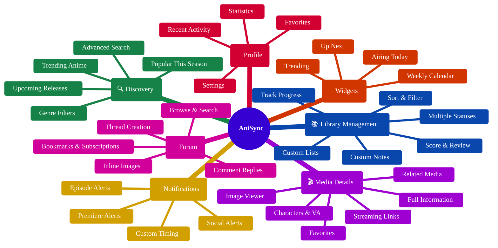

<p align="center">
  
</p>

<h1 align="center">AniSync</h1>

<p align="center">
  <strong>A native Android client for AniList — track your anime and manga the way you want 🌸</strong>
</p>

<p align="center">
  <a href="#-features">✨ Features</a> •
  <a href="#-screenshots">📸 Screenshots</a> •
  <a href="#️-tech-stack">🛠️ Tech Stack</a> •
  <a href="#-getting-started">🚀 Getting Started</a> •
  <a href="#-documentation">📚 Documentation</a> •
  <a href="#-contributing">🤝 Contributing</a>
</p>

<p align="center">
  <a href="https://www.android.com/"></a>
  <a href="https://developer.android.com/about/versions/oreo/"></a>
  <a href="https://kotlinlang.org/"></a>
  <a href="https://developer.android.com/jetpack/compose"></a>
  <a href="LICENSE"></a>
</p>

<p align="center">
  <a href="https://ko-fi.com/marco_9456"></a>
  <a href="https://github.com/sponsors/Marco-9456"></a>
</p>

---

## 📖 Overview

**AniSync** is a native Android app for [AniList.co](https://anilist.co) — the anime and manga tracking platform. It started as a personal project to sharpen my Android skills and experiment with modern tooling, but the UI grew into something I was genuinely proud of, so I decided to share it.

> [!NOTE]
> **A bit of backstory** — This was never meant to be a public release. It was a playground. But once the UI/UX came together, keeping it to myself felt like a waste. I polished it up and here we are. Hope you enjoy it!

### 💡 Why AniSync?

* 📶 **Offline-First** — Full functionality even without an internet connection.
* ✨ **Beautiful UI** — Modern Material 3 design with smooth animations.
* 🔔 **Smart Notifications** — Know exactly when your favorite shows air, and get notified about forum activity too.
* 📱 **Home Screen Widgets** — Quick access to your anime schedule right from your launcher.
* 🔒 **Privacy-Focused** — Your credentials are encrypted locally.

---

## ✨ Features



### 🎯 Core Features

| Feature | Description |
| --- | --- |
| 📚 **Library Management** | Track anime/manga with progress, scores, notes, and custom statuses (Watching, Planning, Completed, Dropped, Paused). Supports custom AniList lists with per-type ordering preferences. |
| 🔍 **Smart Discovery** | Browse trending, popular, upcoming, and TBA anime/manga with powerful search and filters. |
| 🎬 **Media Details** | Comprehensive info including characters, voice actors, relations, and streaming links. Includes a fullscreen image viewer with pinch-to-zoom and image downloads. |
| 💬 **Forum** | Full forum integration — browse, search, and post threads. Supports nested replies, markdown, inline images, bookmarks, subscriptions, and social notifications. |
| 👤 **User Profile** | View your stats, recent activity, favorites, and manage app settings. |
| 👥 **Character Browser** | Explore character details and their appearances across different media. |
| 📊 **Statistics** | Detailed breakdown of your watching/reading habits by genre, score, format, and more. |

### 🧩 Home Screen Widgets

| Widget | Description |
| --- | --- |
| ⏭️ **Up Next** | Shows upcoming episodes from your watching list with countdown timers. |
| 📅 **Airing Today** | Timeline view of all episodes airing today. |
| 🗓️ **Weekly Calendar** | 7-day calendar view of your anime schedule. |
| 🔥 **Trending** | Top 10 trending anime at a glance. |

### 🔔 Notification System

* 📺 **Watching Notifications** — Get notified when episodes from your watching list air.
* 📅 **Planning Notifications** — Know when shows in your planning list premiere.
* 🌟 **Upcoming Notifications** — Discover popular upcoming shows.
* 💬 **Social Notifications** — Forum replies, mentions, comment/thread likes, and thread subscriptions.
* ⚙️ **Customizable Timing** — Set notification lead time (15min to 1 day before), and choose exactly which social events you care about.

---

## 📸 Screenshots

<p align="center">


</p>

---

## 🛠️ Tech Stack

| Category | Technology |
| --- | --- |
| 💻 **Language** | Kotlin 2.2 |
| 🎨 **UI Framework** | Jetpack Compose with Material 3 Expressive |
| 🏗️ **Architecture** | MVVM + Clean Architecture (Use Cases) |
| 💉 **Dependency Injection** | Hilt / Dagger |
| 🗺️ **Navigation** | Navigation Compose (Type-safe routes) |
| 🌐 **Networking** | Apollo GraphQL 4.x |
| 🗄️ **Local Database** | Room with KSP |
| 🖌️ **Theming** | MaterialKolor (dynamic palette styles & seed colors) |
| 🖼️ **Image Loading** | Coil |
| ▶️ **Video Playback** | ExoPlayer with custom Material 3 UI |
| ⏳ **Background Work** | WorkManager |
| 🧩 **Widgets** | Jetpack Glance |
| 📦 **Serialization** | Kotlinx Serialization |
| 🔒 **Security** | EncryptedSharedPreferences (AES-256-GCM) |
| 📱 **Min SDK** | 26 (Android 8.0 Oreo) |
| 🎯 **Target SDK** | 35 (Android 15) |
| ⚙️ **Compile SDK** | 36 |

---

## 🚀 Getting Started

### 📋 Prerequisites

* Android Studio Ladybug (2024.2.1) or newer
* JDK 17
* Android SDK with API 26+

### 🔨 Building the Project

1. **Clone the repository**
```bash
git clone https://github.com/Marco-9456/AniSync.git
cd AniSync
```

2. **Open in Android Studio**
   * File → Open → Select the project directory.
   * Wait for Gradle sync to complete.

3. **Run the app**
   * Select a device/emulator (API 26+).
   * Click Run (▶) or press `Shift + F10`.

### ⚙️ Configuration

#### 🔑 AniList API Setup

The app uses AniList's public GraphQL API. For authenticated features (library management, profile), users log in with their AniList account via OAuth.

> [!TIP]
> No additional API configuration is required — the app is pre-configured for AniList right out of the box!

#### 📦 Build Variants

| Variant | Package ID | Description |
| --- | --- | --- |
| `debug` | `com.anisync.android.debug` | Development build with debug features. |
| `release` | `com.anisync.android` | Production build with ProGuard. |

Both variants can be installed side-by-side for testing.

---

## 📚 Documentation

Comprehensive documentation lives in the `docs/` folder:

| Document | Description |
| --- | --- |
| **[ARCHITECTURE.md](docs/ARCHITECTURE.md)** | System architecture, patterns, and layer responsibilities. |
| **[DATABASE.md](docs/DATABASE.md)** | Room database schema, migrations, and caching strategy. |
| **[API.md](docs/API.md)** | GraphQL integration, authentication, and API reference. |
| **[NAVIGATION.md](docs/NAVIGATION.md)** | Screen flows, navigation graph, and deep links. |
| **[WIDGETS.md](docs/WIDGETS.md)** | Widget architecture and notification system. |
| **[CONTRIBUTING.md](docs/CONTRIBUTING.md)** | Contribution guidelines and code style. |
| **[CHANGELOG.md](docs/CHANGELOG.md)** | Version history and release notes. |

### ⚡ Quick Links

* **Adding a new screen?** → See [NAVIGATION.md](docs/NAVIGATION.md)
* **Changing database schema?** → See [DATABASE.md](docs/DATABASE.md) ⚠️
* **Understanding data flow?** → See [ARCHITECTURE.md](docs/ARCHITECTURE.md)
* **Working with widgets?** → See [WIDGETS.md](docs/WIDGETS.md)

---

## 📂 Project Structure

```text
AniSync/
├── app/
│   ├── src/main/
│   │   ├── java/com/anisync/android/
│   │   │   ├── data/           # Data layer (repositories, local DB)
│   │   │   ├── di/             # Hilt dependency injection modules
│   │   │   ├── domain/         # Domain layer (models, interfaces, use cases)
│   │   │   ├── presentation/   # UI layer (screens, ViewModels)
│   │   │   ├── ui/theme/       # Compose theme (colors, typography)
│   │   │   ├── util/           # Utility functions
│   │   │   ├── widget/         # Glance widgets
│   │   │   └── worker/         # WorkManager jobs
│   │   ├── graphql/            # GraphQL queries and mutations
│   │   └── res/                # Resources (layouts, strings, drawables)
│   └── schemas/                # Room schema exports (for migrations)
├── docs/                       # Documentation
└── gradle/                     # Gradle configuration
```

---

## 🤝 Contributing

Contributions are welcome! Please see [CONTRIBUTING.md](docs/CONTRIBUTING.md) for guidelines.

### 🏃‍♂️ Quick Start for Contributors

1. Fork the repository.
2. Create a feature branch (`git checkout -b feature/amazing-feature`).
3. Make your changes.
4. Run tests and lint (`./gradlew check`).
5. Commit with a descriptive message.
6. Push to your fork and create a Pull Request.

---

## ⚖️ License

This project's source code is licensed under the **GNU General Public License v3.0** — see the [LICENSE](LICENSE) file for details.

> [!WARNING]
> **Brand & Naming Guidelines**
> While the source code is freely available under the GPLv3, the **AniSync** name and brand identity are protected. Any derivative works — including forks and unofficial builds — are strictly prohibited from using "AniSync" as the name for an AniList client application.

---

## 🙏 Acknowledgments

* [AniList](https://anilist.co) for the excellent GraphQL API.
* [Material Design 3](https://m3.material.io) for the design system.
* [Seal](https://github.com/JunkFood02/Seal) and [ReadYou](https://github.com/ReadYouApp/ReadYou) for UI/UX inspiration.
* The Android and Kotlin communities for amazing tools and libraries.

---

<p align="center">
Made with ❤️ for anime fans
</p>
