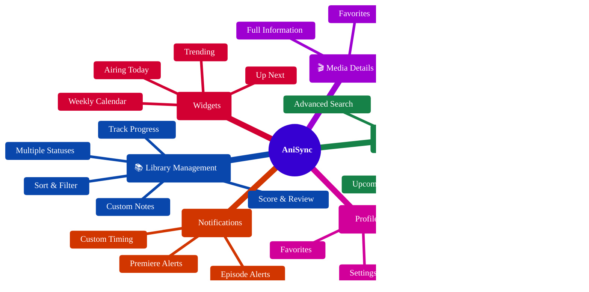
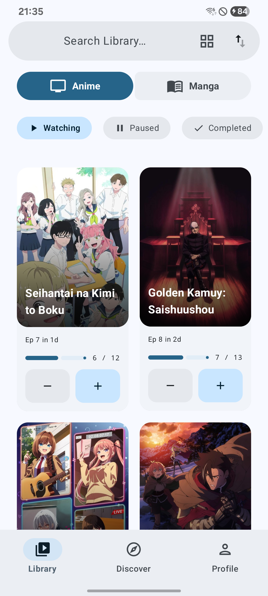
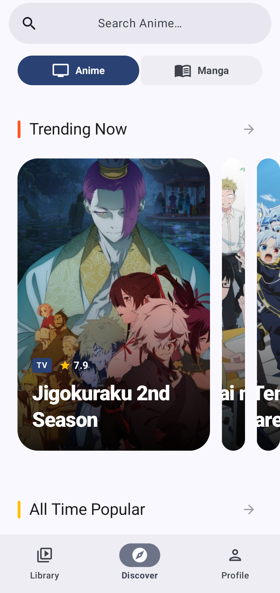
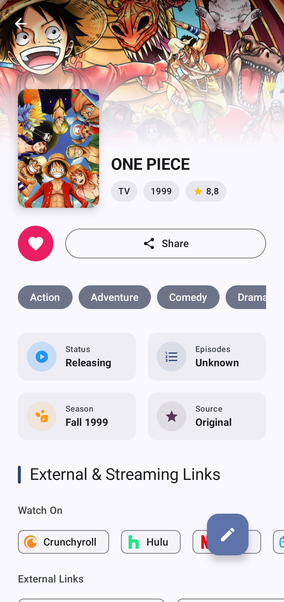
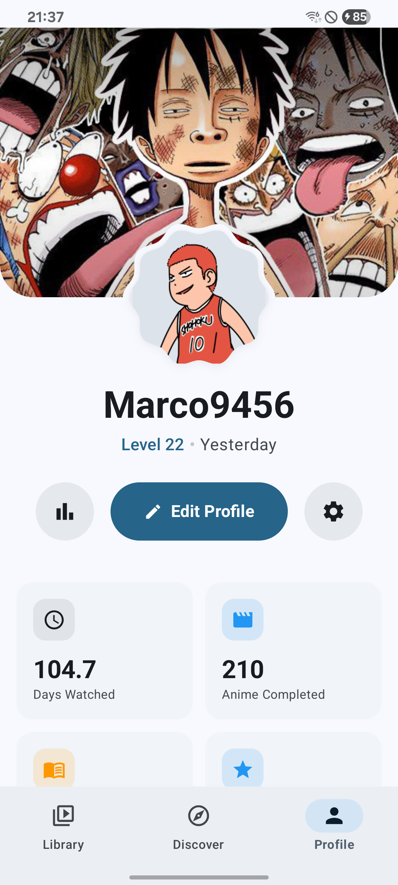
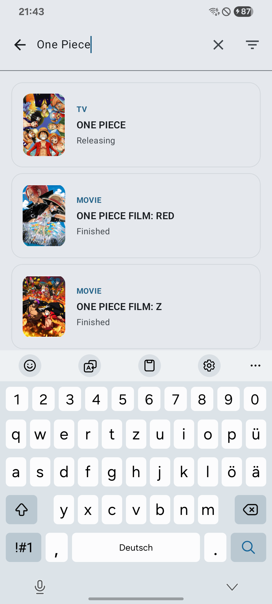
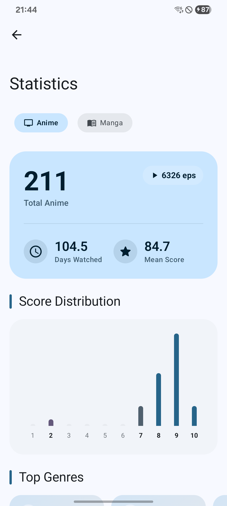
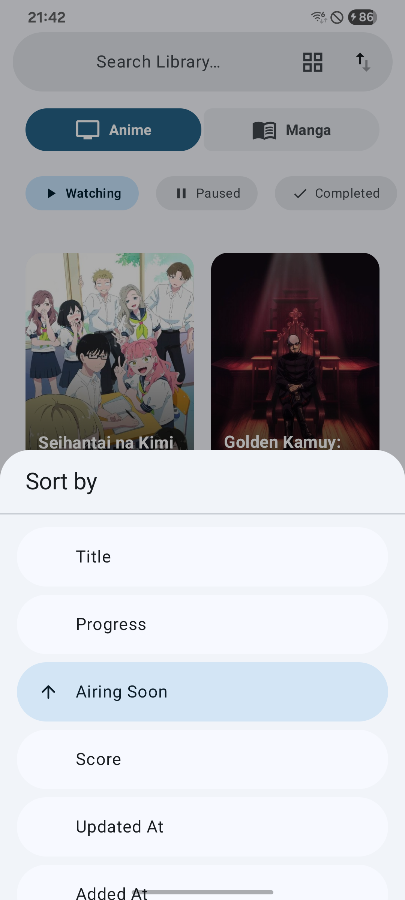
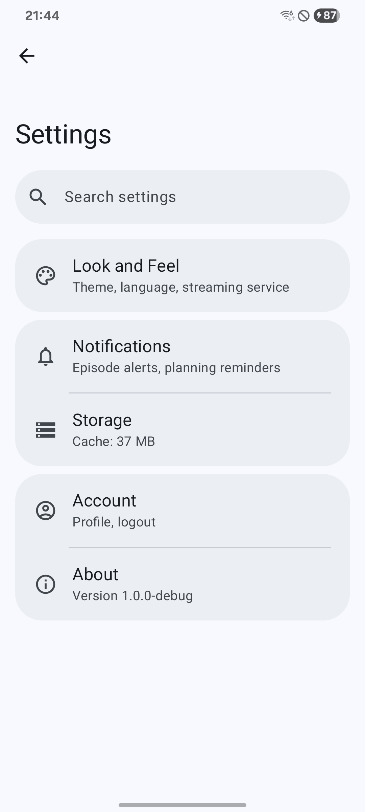

<p align="center">
  
</p>

<h1 align="center">AniSync</h1>

<p align="center">
  <strong>A modern Android client for AniList - Track your anime and manga journey 🌸</strong>
</p>

<p align="center">
  <a href="#-features">✨ Features</a> •
  <a href="#-screenshots">📸 Screenshots</a> •
  <a href="#️-tech-stack">🛠️ Tech Stack</a> •
  <a href="#-getting-started">🚀 Getting Started</a> •
  <a href="#-documentation">📚 Documentation</a> •
  <a href="#-contributing">🤝 Contributing</a>
</p>

<p align="center">
  
  
  
  
  
</p>

---

## 📖 Overview

**AniSync** is a native Android application for [AniList.co](https://anilist.co) - the popular anime and manga tracking platform. Built with modern Android development practices, AniSync provides a seamless experience for tracking your watching/reading progress, discovering new content, and staying updated with episode releases.

> [!NOTE]
> **A note on the project's origins** > This project originally started out as a personal playground—a way for me to experiment, learn new technologies, and hone my Android development skills. It was never initially intended for a public release. However, as the app grew and the UI/UX really started to come together, it felt like a waste to keep it to myself. I decided to polish it up and share it with the community in hopes that others might find it just as useful and enjoyable!

### 💡 Why AniSync?

* 📶 **Offline-First**: Full functionality even without an internet connection.
* ✨ **Beautiful UI**: Modern Material 3 design with smooth animations.
* 🔔 **Smart Notifications**: Know exactly when your favorite shows air.
* 📱 **Home Screen Widgets**: Quick access to your anime schedule right from your launcher.
* 🔒 **Privacy-Focused**: Your credentials are encrypted locally.

---

## ✨ Features



### 🎯 Core Features

| Feature | Description |
| --- | --- |
| 📚 **Library Management** | Track anime/manga with progress, scores, notes, and custom statuses (Watching, Planning, Completed, Dropped, Paused). |
| 🔍 **Smart Discovery** | Browse trending, popular, upcoming, and TBA anime/manga with powerful search and filters. |
| 🎬 **Media Details** | View comprehensive information including characters, voice actors, relations, and streaming links. |
| 👤 **User Profile** | View your stats, recent activity, favorites, and manage app settings. |
| 👥 **Character Browser** | Explore character details and their appearances across different media. |
| 📊 **Statistics** | Detailed breakdown of your watching/reading habits by genre, score, format, and more. |

### 🧩 Home Screen Widgets

| Widget | Description |
| --- | --- |
| ⏭️ **Up Next** | Shows upcoming episodes from your watching list with countdown timers. |
| 📅 **Airing Today** | Timeline view of all episodes airing today. |
| 🗓️ **Weekly Calendar** | 7-day calendar view of your anime schedule. |
| 🔥 **Trending** | Top 10 trending anime at a glance. |

### 🔔 Notification System

* 📺 **Watching Notifications**: Get notified when episodes from your watching list air.
* 📅 **Planning Notifications**: Know when shows in your planning list premiere.
* 🌟 **Upcoming Notifications**: Discover popular upcoming shows.
* ⚙️ **Customizable Timing**: Set notification lead time (15min to 1 day before).

---

## 📸 Screenshots

<p align="center">








</p>

---

## 🛠️ Tech Stack

| Category | Technology |
| --- | --- |
| 💻 **Language** | Kotlin 2.2 |
| 🎨 **UI Framework** | Jetpack Compose with Material 3 Expressive |
| 🏗️ **Architecture** | MVVM + Clean Architecture (Use Cases) |
| 💉 **Dependency Injection** | Hilt / Dagger |
| 🗺️ **Navigation** | Navigation Compose (Type-safe routes) |
| 🌐 **Networking** | Apollo GraphQL 4.x |
| 🗄️ **Local Database** | Room with KSP |
| 🖌️ **Theming** | MaterialKolor (dynamic palette styles & seed colors) |
| 🖼️ **Image Loading** | Coil |
| ⏳ **Background Work** | WorkManager |
| 🧩 **Widgets** | Jetpack Glance |
| 📦 **Serialization** | Kotlinx Serialization |
| 🔒 **Security** | EncryptedSharedPreferences (AES-256-GCM) |
| 📱 **Min SDK** | 26 (Android 8.0 Oreo) |
| 🎯 **Target SDK** | 35 (Android 15) |
| ⚙️ **Compile SDK** | 36 |

---

## 🚀 Getting Started

### 📋 Prerequisites

* Android Studio Ladybug (2024.2.1) or newer
* JDK 17
* Android SDK with API 26+

### 🔨 Building the Project

1. **Clone the repository**
```bash
git clone [https://github.com/Marco-9456/AniSync.git](https://github.com/Marco-9456/AniSync.git)
cd AniSync

```


2. **Open in Android Studio**
* File → Open → Select the project directory.
* Wait for Gradle sync to complete.


3. **Run the app**
* Select a device/emulator (API 26+).
* Click Run (▶) or press `Shift + F10`.


### ⚙️ Configuration

#### 🔑 AniList API Setup

The app uses AniList's public GraphQL API. For authenticated features (library management, profile), users log in with their AniList account via OAuth.

> [!TIP]
> No additional API configuration is required - the app is pre-configured for AniList right out of the box!

#### 📦 Build Variants

| Variant | Package ID | Description |
| --- | --- | --- |
| `debug` | `com.anisync.android.debug` | Development build with debug features. |
| `release` | `com.anisync.android` | Production build with ProGuard. |

Both variants can be installed side-by-side for testing.

---

## 📚 Documentation

Comprehensive documentation is available in the `docs/` folder:

| Document | Description |
| --- | --- |
| **[ARCHITECTURE.md](https://www.google.com/search?q=docs/ARCHITECTURE.md)** | System architecture, patterns, and layer responsibilities. |
| **[DATABASE.md](https://www.google.com/search?q=docs/DATABASE.md)** | Room database schema, migrations, and caching strategy. |
| **[API.md](https://www.google.com/search?q=docs/API.md)** | GraphQL integration, authentication, and API reference. |
| **[NAVIGATION.md](https://www.google.com/search?q=docs/NAVIGATION.md)** | Screen flows, navigation graph, and deep links. |
| **[WIDGETS.md](https://www.google.com/search?q=docs/WIDGETS.md)** | Widget architecture and notification system. |
| **[CONTRIBUTING.md](https://www.google.com/search?q=docs/CONTRIBUTING.md)** | Contribution guidelines and code style. |
| **[CHANGELOG.md](https://www.google.com/search?q=docs/CHANGELOG.md)** | Version history and release notes. |

### ⚡ Quick Links

* **Adding a new screen?** → See [NAVIGATION.md](https://www.google.com/search?q=docs/NAVIGATION.md)
* **Changing database schema?** → See [DATABASE.md](https://www.google.com/search?q=docs/DATABASE.md) ⚠️
* **Understanding data flow?** → See [ARCHITECTURE.md](https://www.google.com/search?q=docs/ARCHITECTURE.md)
* **Working with widgets?** → See [WIDGETS.md](https://www.google.com/search?q=docs/WIDGETS.md)

---

## 📂 Project Structure

```text
AniSync/
├── app/
│   ├── src/main/
│   │   ├── java/com/anisync/android/
│   │   │   ├── data/           # Data layer (repositories, local DB)
│   │   │   ├── di/             # Hilt dependency injection modules
│   │   │   ├── domain/         # Domain layer (models, interfaces, use cases)
│   │   │   ├── presentation/   # UI layer (screens, ViewModels)
│   │   │   ├── ui/theme/       # Compose theme (colors, typography)
│   │   │   ├── util/           # Utility functions
│   │   │   ├── widget/         # Glance widgets
│   │   │   └── worker/         # WorkManager jobs
│   │   ├── graphql/            # GraphQL queries and mutations
│   │   └── res/                # Resources (layouts, strings, drawables)
│   └── schemas/                # Room schema exports (for migrations)
├── docs/                       # Documentation
└── gradle/                     # Gradle configuration

```

---

## 🤝 Contributing

We welcome contributions! Please see [CONTRIBUTING.md](https://www.google.com/search?q=docs/CONTRIBUTING.md) for guidelines.

### 🏃‍♂️ Quick Start for Contributors

1. Fork the repository.
2. Create a feature branch (`git checkout -b feature/amazing-feature`).
3. Make your changes.
4. Run tests and lint (`./gradlew check`).
5. Commit with a descriptive message.
6. Push to your fork and create a Pull Request.

---

## 🚧 Missing Features (Forum / Posts)

You might notice that certain AniList social features, such as the **Forum** or user **Posts/Status Updates**, are currently missing from the app.

The honest reason is that I don't use these features myself, and I wanted to avoid cluttering the app with tabs and functionality that many users might never touch. I prefer keeping the experience focused on tracking, discovery, and aesthetics.

However, this isn't set in stone. If I can come up with a clean, unobtrusive UI/UX for them—or if there's enough demand and I receive some great design suggestions from the community—I may consider implementing them in the future!

---

## ⚖️ License

This project's source code is licensed under the **GNU General Public License v3.0** - see the [LICENSE](LICENSE) file for details. 

> [!WARNING]
> **Brand & Naming Guidelines**
> While the source code is freely available under the GPLv3, the **AniSync** name and brand identity are protected. To avoid user confusion, any derivative works—including but not limited to forks and unofficial builds—are strictly prohibited from using "AniSync" as the name for an AniList client application.

---

## ☕ Support the Project

I make apps for fun, buy me a coffee if you love them like I do!

* [Sponsor on GitHub](https://github.com/sponsors/Marco-9456)
* [Support on Ko-fi](https://ko-fi.com/marco_9456) (also available if you don't have a GitHub account)

---

## 🙏 Acknowledgments

* [AniList](https://anilist.co) for providing the excellent GraphQL API.
* [Material Design 3](https://m3.material.io) for the design system.
* The Android and Kotlin communities for amazing tools and libraries.

---

<p align="center">
Made with ❤️ for anime fans
</p>