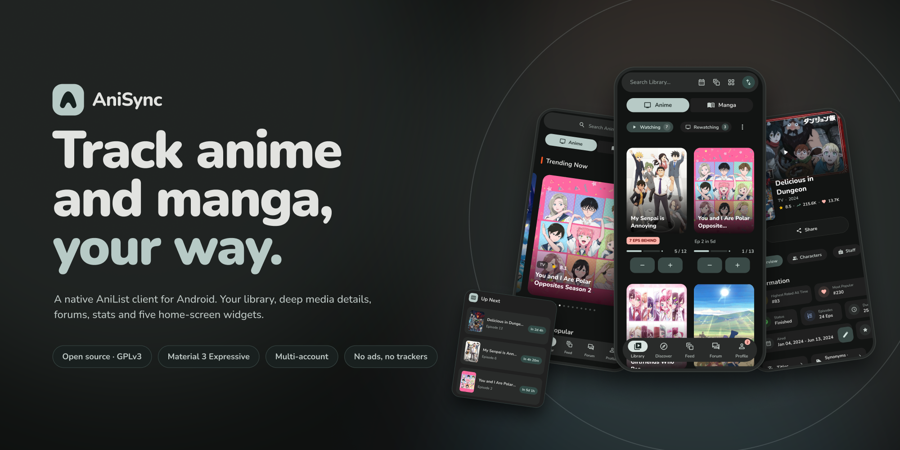

# AniSync (Enhanced Fork)

  

  <strong>A native Android client for AniList — track your anime and manga the way you want, now with Gemini AI integration, real-time airing countdowns, and PIN-locked Hidden/Ghost lists.</strong>

  
  
  
  
  

AniSync is a native Android app for [AniList.co](https://anilist.co) — a fast way to track your anime and manga, discover new stuff, and keep up with the community without a browser tab.

> [!NOTE]
> AniSync is not affiliated with AniList. It's a third-party client built for the AniList community.

---

## ✨ Features Added in this Fork

This fork includes several major enhancements, AI tools, and privacy improvements:

### 🔒 Hidden / Ghost List & PIN Protection

#### How the Hidden Logic Works:
1. **AniList Privacy Sync**: Whenever you edit an anime or manga entry and enable **"Hidden from status lists"** OR mark it **"Private"** (either on the AniList website or in-app), AniSync classifies it as a **Ghost/Hidden Entry**.
2. **Total Isolation**: Hidden entries are automatically filtered out from all regular library tabs (*Watching, Completed, Planning, Paused, Dropped, Repeating*) and general library searches to keep your list completely discreet.
3. **PIN-Locked Tab**: All hidden entries are moved into the dedicated **Hidden** tab in your Library.
   - Protected by a built-in 4-digit numeric keypad with auto-unlock upon entering the correct PIN.
   - **Session Security**: Whenever you restart or reopen the app, the tab resets automatically back to *All* so your hidden list is never left exposed.

---

### 🤖 Built-in Gemini AI Assistant
- **Quick Access**: AI Chat icon located directly in the top search bar on Home and Discover screens.
- **Context-Aware Anime Chat**: Open AI Chat from inside any anime/manga details screen to ask specific questions about the story, characters, themes, or recommendations with media context pre-loaded.
- **User Data Context**: Option to allow the AI to access your personalized list data (progress, personal score, notes, start/finish dates) or keep conversations strictly general.
- **Spoiler Protection**: Configurable spoiler toggle to strictly prevent or allow spoilers in AI answers.
- **Custom Model Support**: Choose from preset models (`gemini-2.5-flash`, `gemini-2.5-flash-lite`, `gemini-3-flash-preview`, `gemma-4-31b-it`, etc.) or input any custom Gemini model ID.
- **AI Chat History**: Dedicated History tab to review previous conversations.

---

### 📡 AI News Radar (Feed Screen)
- **Live Anime News**: Get up-to-the-minute anime & manga industry news, trailers, cast reveals, and release date announcements powered by Google Search Grounding.
- **Persistent State**: News results stay loaded while navigating the app and only refresh on demand when you tap the refresh button.
- **Topic Filters**: Browse by *All*, *Trailers & PVs*, *Release Dates*, *Cast & Announcements*, or *Industry News*.

---

### ⏱️ Live Airing Countdown Badges
- Dynamic real-time countdown badges on Library "Watching" cards and Calendar views for anime episodes airing today.

---

## 📱 Base Features

- **Tracking** — Statuses, scores, progress, notes, and custom lists for your anime and manga.
- **Search & Discovery** — Trending, seasonal, and upcoming titles with multi-criteria filters.
- **Media Details** — Characters, voice actors, staff, trailers, reviews, recommendations, and streaming links.
- **Feed & Forums** — Social activity feed, forum threads, posts, replies, and notifications.
- **Stats** — Detailed breakdown charts of your anime and manga habits.
- **Widgets** — Airing schedule widgets for your Android home screen.

---

## 🛠️ Building & CI

This repository uses automated GitHub Actions workflows to compile **Release APKs** on push. You can download the latest builds directly from the GitHub Actions tab or Releases section.

---

## 📄 License

This project's source code is licensed under the **GNU General Public License v3.0** — see the [LICENSE](LICENSE) file for details.
