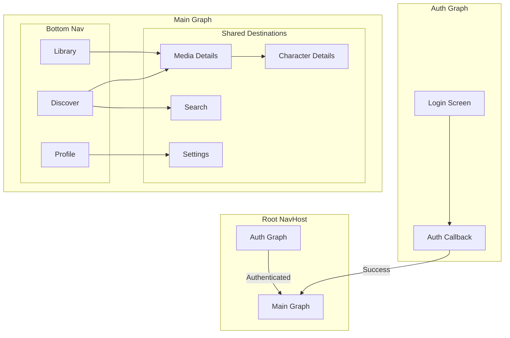
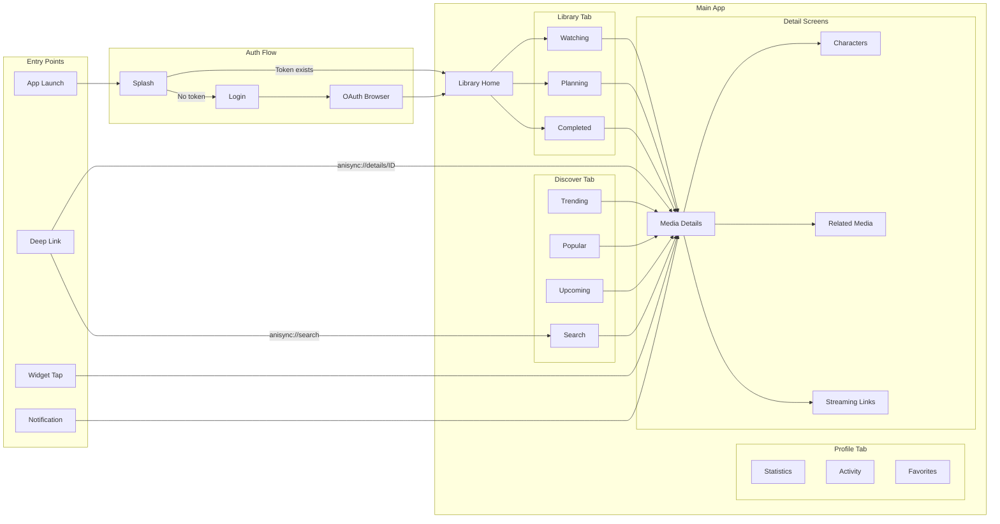
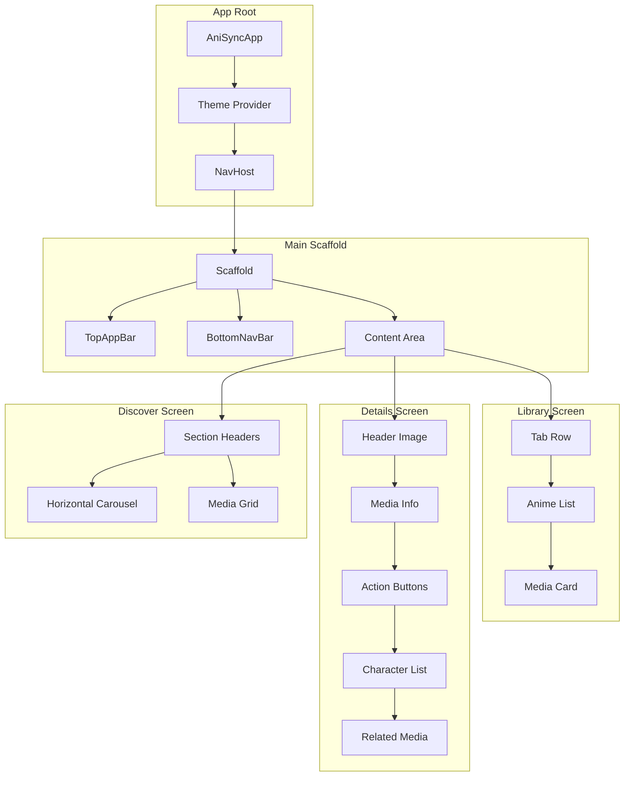

# Navigation

This document covers AniSync's navigation architecture, screen flows, routes, and deep linking.

---

## Table of Contents

1. [Overview](#overview)
2. [Navigation Graph](#navigation-graph)
3. [Screen Hierarchy](#screen-hierarchy)
4. [Route Definitions](#route-definitions)
5. [Deep Links](#deep-links)
6. [Transitions](#transitions)

---

## Overview

AniSync uses **Navigation Compose** with type-safe routes for all navigation:

- **Type-safe routes** using Kotlin serialization
- **Bottom navigation** for main destinations
- **Nested navigation graphs** for feature modules
- **Deep link support** for external entry points

---

## Navigation Graph

### Main Navigation Structure



### Complete Navigation Flow



---

## Screen Hierarchy

### Component Tree



---

## Route Definitions

### Type-Safe Routes

```kotlin
// Navigation routes using Kotlin serialization
@Serializable
sealed interface Route {
    
    @Serializable
    data object Auth : Route {
        @Serializable
        data object Login : Route
        
        @Serializable
        data object Callback : Route
    }
    
    @Serializable
    data object Main : Route {
        @Serializable
        data object Library : Route
        
        @Serializable
        data object Discover : Route
        
        @Serializable
        data object Profile : Route
    }
    
    @Serializable
    data class MediaDetails(val id: Int) : Route
    
    @Serializable
    data class CharacterDetails(val id: Int) : Route
    
    @Serializable
    data object Search : Route
    
    @Serializable
    data object Settings : Route
}
```

### Navigation Setup

```kotlin
@Composable
fun AniSyncNavHost(
    navController: NavHostController,
    startDestination: Route
) {
    NavHost(
        navController = navController,
        startDestination = startDestination
    ) {
        // Auth flow
        navigation<Route.Auth>(startDestination = Route.Auth.Login) {
            composable<Route.Auth.Login> {
                LoginScreen(
                    onLoginClick = { /* Open OAuth */ },
                    onLoginSuccess = {
                        navController.navigate(Route.Main) {
                            popUpTo(Route.Auth) { inclusive = true }
                        }
                    }
                )
            }
        }
        
        // Main app
        navigation<Route.Main>(startDestination = Route.Main.Library) {
            composable<Route.Main.Library> {
                LibraryScreen(
                    onMediaClick = { id ->
                        navController.navigate(Route.MediaDetails(id))
                    }
                )
            }
            
            composable<Route.Main.Discover> {
                DiscoverScreen(
                    onMediaClick = { id ->
                        navController.navigate(Route.MediaDetails(id))
                    },
                    onSearchClick = {
                        navController.navigate(Route.Search)
                    }
                )
            }
            
            composable<Route.Main.Profile> {
                ProfileScreen(
                    onSettingsClick = {
                        navController.navigate(Route.Settings)
                    }
                )
            }
        }
        
        // Shared destinations
        composable<Route.MediaDetails>(
            deepLinks = listOf(
                navDeepLink { uriPattern = "anisync://details/{id}" }
            )
        ) { backStackEntry ->
            val route = backStackEntry.toRoute<Route.MediaDetails>()
            MediaDetailsScreen(
                mediaId = route.id,
                onCharacterClick = { charId ->
                    navController.navigate(Route.CharacterDetails(charId))
                },
                onRelatedMediaClick = { mediaId ->
                    navController.navigate(Route.MediaDetails(mediaId))
                },
                onBackClick = { navController.popBackStack() }
            )
        }
        
        composable<Route.Search>(
            deepLinks = listOf(
                navDeepLink { uriPattern = "anisync://search" }
            )
        ) {
            SearchScreen(
                onMediaClick = { id ->
                    navController.navigate(Route.MediaDetails(id))
                },
                onBackClick = { navController.popBackStack() }
            )
        }
    }
}
```

---

## Deep Links

### Supported Deep Links

| URI Pattern | Destination | Example |
|-------------|-------------|---------|
| `anisync://details/{id}` | Media Details | `anisync://details/21` |
| `anisync://search` | Search Screen | `anisync://search` |
| `anisync://search?q={query}` | Search with Query | `anisync://search?q=naruto` |
| `anisync://library` | Library Screen | `anisync://library` |
| `anisync://auth` | Auth Callback | `anisync://auth?token=...` |

### AndroidManifest Configuration

```xml
<activity
    android:name=".MainActivity"
    android:exported="true">
    
    <intent-filter>
        <action android:name="android.intent.action.MAIN" />
        <category android:name="android.intent.category.LAUNCHER" />
    </intent-filter>
    
    <!-- Deep links -->
    <intent-filter android:autoVerify="true">
        <action android:name="android.intent.action.VIEW" />
        <category android:name="android.intent.category.DEFAULT" />
        <category android:name="android.intent.category.BROWSABLE" />
        <data android:scheme="anisync" />
    </intent-filter>
</activity>
```

### Widget Intent Creation

```kotlin
object WidgetIntentUtils {
    fun createDetailsIntent(context: Context, mediaId: Int): Intent {
        return Intent(
            Intent.ACTION_VIEW,
            "anisync://details/$mediaId".toUri()
        ).apply {
            setClass(context, MainActivity::class.java)
            flags = Intent.FLAG_ACTIVITY_NEW_TASK
        }
    }
}
```

---

## Transitions

### Default Transitions

```kotlin
@Composable
fun AniSyncNavHost(...) {
    NavHost(
        navController = navController,
        startDestination = startDestination,
        enterTransition = {
            slideIntoContainer(
                towards = AnimatedContentTransitionScope.SlideDirection.Start,
                animationSpec = tween(300)
            )
        },
        exitTransition = {
            slideOutOfContainer(
                towards = AnimatedContentTransitionScope.SlideDirection.Start,
                animationSpec = tween(300)
            )
        },
        popEnterTransition = {
            slideIntoContainer(
                towards = AnimatedContentTransitionScope.SlideDirection.End,
                animationSpec = tween(300)
            )
        },
        popExitTransition = {
            slideOutOfContainer(
                towards = AnimatedContentTransitionScope.SlideDirection.End,
                animationSpec = tween(300)
            )
        }
    ) {
        // ...
    }
}
```

### Shared Element Transitions

```kotlin
// Media card in list
SharedTransitionLayout {
    AnimatedContent(targetState = ...) { ... }
}

// Media details header
composable<Route.MediaDetails> {
    SharedTransitionScope {
        MediaDetailsScreen(
            sharedTransitionScope = this,
            animatedVisibilityScope = this@composable
        )
    }
}
```

---

## Bottom Navigation

### Bottom Nav Implementation

```kotlin
@Composable
fun MainBottomNavBar(
    navController: NavHostController,
    currentRoute: Route?
) {
    val items = listOf(
        BottomNavItem(
            route = Route.Main.Library,
            icon = Icons.Outlined.VideoLibrary,
            selectedIcon = Icons.Filled.VideoLibrary,
            label = "Library"
        ),
        BottomNavItem(
            route = Route.Main.Discover,
            icon = Icons.Outlined.Explore,
            selectedIcon = Icons.Filled.Explore,
            label = "Discover"
        ),
        BottomNavItem(
            route = Route.Main.Profile,
            icon = Icons.Outlined.Person,
            selectedIcon = Icons.Filled.Person,
            label = "Profile"
        )
    )
    
    NavigationBar {
        items.forEach { item ->
            val isSelected = currentRoute == item.route
            
            NavigationBarItem(
                selected = isSelected,
                onClick = {
                    navController.navigate(item.route) {
                        popUpTo(navController.graph.findStartDestination().id) {
                            saveState = true
                        }
                        launchSingleTop = true
                        restoreState = true
                    }
                },
                icon = {
                    Icon(
                        imageVector = if (isSelected) item.selectedIcon else item.icon,
                        contentDescription = item.label
                    )
                },
                label = { Text(item.label) }
            )
        }
    }
}
```

---

## Related Documentation

- [ARCHITECTURE.md](ARCHITECTURE.md) - Overall app architecture
- [WIDGETS.md](WIDGETS.md) - Widget navigation intents
- [CONTRIBUTING.md](CONTRIBUTING.md) - Adding new screens
