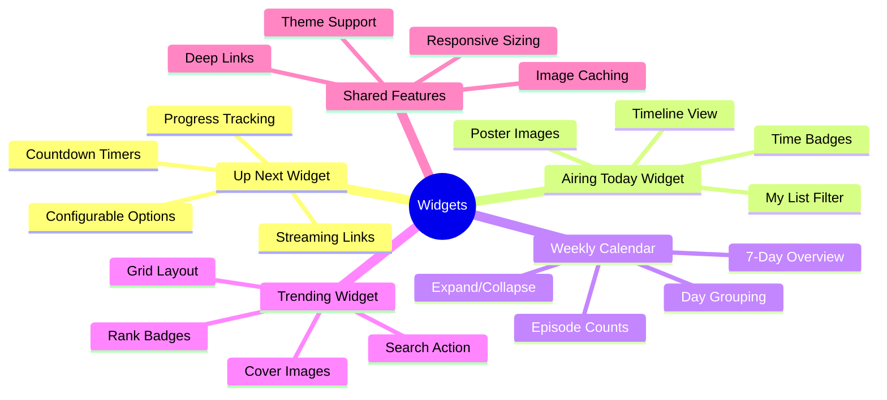
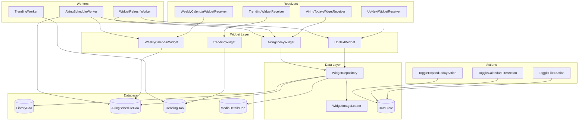
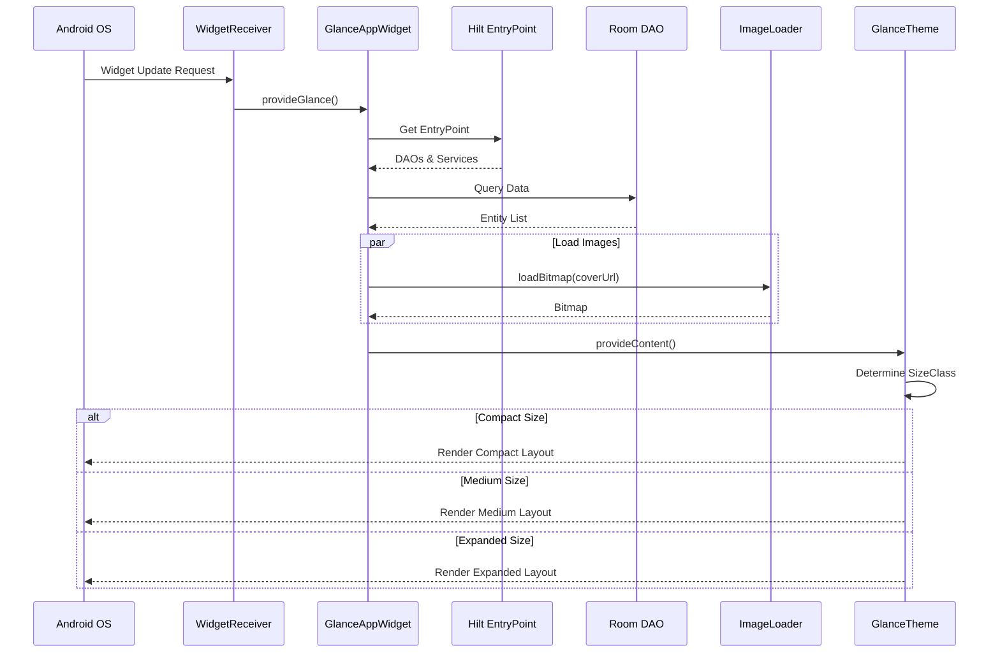
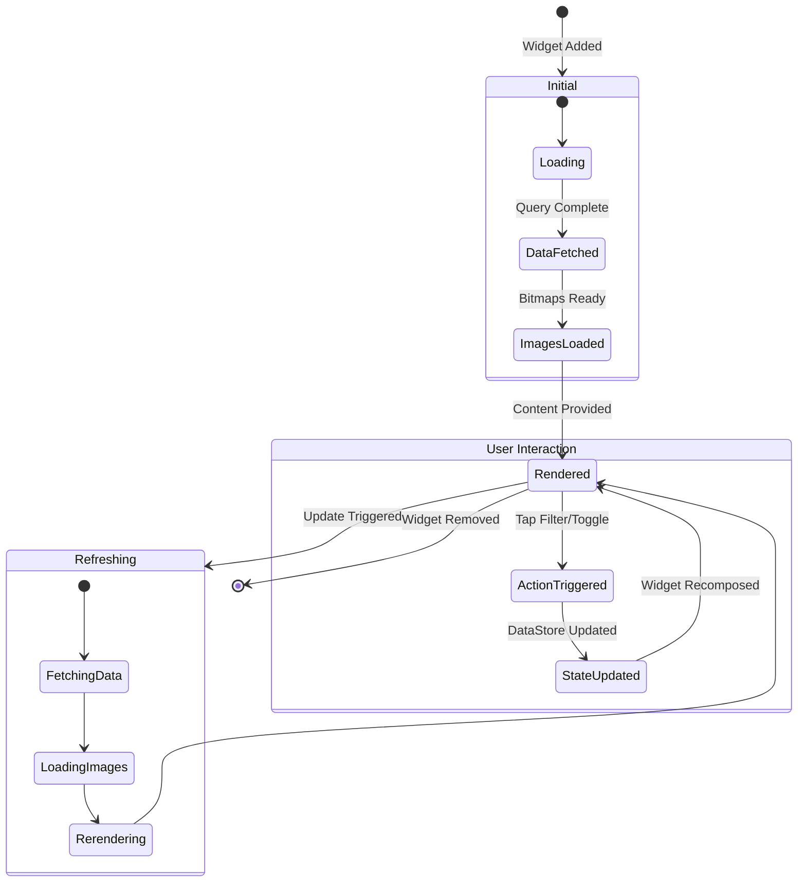
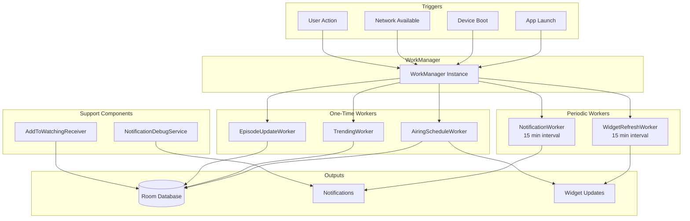

# Widgets & Notifications

This document covers AniSync's Jetpack Glance widgets and the notification system, including architecture, data flow, and implementation details.

---

## Table of Contents

1. [Widget Overview](#widget-overview)
2. [Widget Architecture](#widget-architecture)
3. [Individual Widgets](#individual-widgets)
4. [Background Workers](#background-workers)
5. [Notification System](#notification-system)
6. [Design System](#design-system)
7. [Implementation Guide](#implementation-guide)

---

## Widget Overview

AniSync provides 4 home screen widgets built with **Jetpack Glance** (Compose for widgets):

| Widget | Description | Size Modes |
|--------|-------------|------------|
| **Up Next** | Upcoming episodes from watching list with countdown timers | Compact, Medium, Expanded |
| **Airing Today** | Timeline view of all episodes airing today | Compact, Medium, Expanded |
| **Weekly Calendar** | 7-day calendar view of anime schedule | Compact, Medium, Expanded |
| **Trending** | Top trending anime in grid layout | Compact, Medium, Expanded |

### Widget Features Mindmap



---

## Widget Architecture

### System Architecture Diagram



### Data Flow Sequence



### Widget State Management



---

## Individual Widgets

### Up Next Widget

Shows upcoming episodes from the user's watching list with real-time countdown timers.

#### Features
- **Real-time countdown** using Android's native `Chronometer` widget
- **Streaming service integration** - Quick link to preferred streaming platform
- **Configurable options** via widget configuration activity
- **Smart episode logic** - Skips episodes that aired more than 30 minutes ago

#### Size Modes

| Mode | Height | Layout |
|------|--------|--------|
| Compact | ≤100dp | Single episode badge with title |
| Medium | 100-300dp | Single card with progress bar |
| Expanded | >300dp | Scrollable list with countdown cards |

#### Configuration Options

```kotlin
// UpNextWidgetConfig.kt
object UpNextWidgetConfig {
    val ShowCountdownKey = booleanPreferencesKey("show_countdown")
    val MaxItemsKey = intPreferencesKey("max_items")
    val ShowAvailableNowKey = booleanPreferencesKey("show_available_now")
    
    const val DEFAULT_SHOW_COUNTDOWN = true
    const val DEFAULT_MAX_ITEMS = 5
    const val DEFAULT_SHOW_AVAILABLE_NOW = true
}
```

#### Data Sources

| Source | Purpose |
|--------|---------|
| `LibraryDao.getUpNext()` | Watching list entries |
| `AiringScheduleDao` | Episode airing times |
| `MediaDetailsDao` | Streaming service links |
| `AppSettings` | Preferred streaming service |

---

### Airing Today Widget

Timeline view of all anime episodes airing today with chronological ordering.

#### Features
- **Timeline design** with vertical line connector and time badges
- **My List filter** - Toggle between all anime and user's watching list
- **Poster images** - Pre-loaded cover art
- **Star indicator** for shows in watching list

#### Layout Structure

```
┌─────────────────────────────────────┐
│ 📅 Airing Today          [All ▾]   │
├─────────────────────────────────────┤
│ ┌─────┐                             │
│ │14:00│──┬──────────────────────┐  │
│ └─────┘  │ [IMG] Anime Title    │  │
│    │     │       Episode 12   ⭐│  │
│    │     └──────────────────────┘  │
│ ┌─────┐                             │
│ │15:30│──┬──────────────────────┐  │
│ └─────┘  │ [IMG] Another Anime  │  │
│          │       Episode 8      │  │
│          └──────────────────────┘  │
└─────────────────────────────────────┘
```

---

### Weekly Calendar Widget

7-day overview showing episode counts per day with expandable day sections.

#### Features
- **7-day view** starting from today
- **Episode count badges** per day
- **Expand/collapse** for today's detailed view
- **My List filter** toggle

#### Day Ordering Logic

```kotlin
// Reorder days starting from today
val todayIndex = allDays.indexOf(todayDayOfWeek)
val days = if (todayIndex >= 0) {
    allDays.subList(todayIndex, allDays.size) + 
    allDays.subList(0, todayIndex)
} else {
    allDays
}.take(7)
```

---

### Trending Widget

Grid layout showing top trending anime with rank badges.

#### Features
- **3-column grid** in expanded mode
- **Rank badges** at bottom-left of each card
- **Search action** button in header
- **Full-bleed images** with rounded corners

#### Grid Structure (Expanded)

```
┌─────────────────────────────────────┐
│ 📈 Trending Now             [🔍]   │
├─────────────────────────────────────┤
│ ┌───────┐ ┌───────┐ ┌───────┐      │
│ │       │ │       │ │       │      │
│ │ IMG   │ │ IMG   │ │ IMG   │      │
│ │  #1   │ │  #2   │ │  #3   │      │
│ └───────┘ └───────┘ └───────┘      │
│ ┌───────┐ ┌───────┐ ┌───────┐      │
│ │       │ │       │ │       │      │
│ │ IMG   │ │ IMG   │ │ IMG   │      │
│ │  #4   │ │  #5   │ │  #6   │      │
│ └───────┘ └───────┘ └───────┘      │
└─────────────────────────────────────┘
```

---

## Background Workers

Workers keep widget data fresh using WorkManager for reliable background execution.

### Worker Architecture



### Worker Details

| Worker | Interval | Constraints | Purpose |
|--------|----------|-------------|---------|
| `NotificationWorker` | 15 min | Network | Check for new airing notifications |
| `WidgetRefreshWorker` | 15 min | None | Update countdown timers |
| `AiringScheduleWorker` | On-demand | Network | Fetch 7-day airing schedule |
| `TrendingWorker` | On-demand | Network | Fetch trending anime |
| `EpisodeUpdateWorker` | On-demand | Network | Sync episode progress |
| `AddToWatchingReceiver` | On-demand | Network | Handle "Add to Watching" action from notifications |
| `NotificationDebugService` | Manual | None | Debug tool for testing notification delivery |

### NotificationScheduler

```kotlin
@Singleton
class NotificationScheduler @Inject constructor(
    @ApplicationContext private val context: Context
) {
    companion object {
        private const val WORK_NAME = "notification_worker"
        private const val REPEAT_INTERVAL_MINUTES = 15L
    }

    fun schedule() {
        val constraints = Constraints.Builder()
            .setRequiredNetworkType(NetworkType.CONNECTED)
            .build()

        val workRequest = PeriodicWorkRequestBuilder<NotificationWorker>(
            REPEAT_INTERVAL_MINUTES, TimeUnit.MINUTES
        )
            .setInitialDelay(REPEAT_INTERVAL_MINUTES, TimeUnit.MINUTES)
            .setConstraints(constraints)
            .build()

        workManager.enqueueUniquePeriodicWork(
            WORK_NAME,
            ExistingPeriodicWorkPolicy.UPDATE,
            workRequest
        )
    }
}
```

---

## Notification System

### Notification Flow

```mermaid
flowchart TB
    subgraph "NotificationWorker"
        START[doWork]
        AUTH{Authenticated?}
        FIRST{First Run?}
        BASELINE[Perform Baseline Sync]
        
        subgraph "Notification Checks"
            WATCHING[Check Watching List]
            UPCOMING[Check Upcoming Episodes]
            PLANNING[Check Planning First Episodes]
        end
    end

    subgraph "Notification Types"
        AIRING[Airing Notification<br/>Episode X has aired]
        ADVANCE[Advance Notice<br/>12h before premiere]
        IMMINENT[Imminent Notice<br/>2h before premiere]
        PREMIERE[Premiere Alert<br/>Episode 1 available]
    end

    subgraph "Channels"
        CH_AIRING[airing_notifications]
        CH_UPCOMING[upcoming_notifications]
        CH_PLANNING[planning_notifications]
    end

    START --> AUTH
    AUTH -->|No| END[Skip]
    AUTH -->|Yes| FIRST
    FIRST -->|Yes| BASELINE
    FIRST -->|No| WATCHING
    BASELINE --> END
    
    WATCHING --> UPCOMING
    UPCOMING --> PLANNING
    
    WATCHING --> AIRING
    UPCOMING --> ADVANCE
    UPCOMING --> IMMINENT
    PLANNING --> PREMIERE
    
    AIRING --> CH_AIRING
    ADVANCE --> CH_UPCOMING
    IMMINENT --> CH_UPCOMING
    PREMIERE --> CH_PLANNING
```



### Notification Channels

```kotlin
object NotificationChannels {
    const val AIRING_CHANNEL_ID = "airing_notifications"
    const val PLANNING_CHANNEL_ID = "planning_notifications"
    const val UPCOMING_CHANNEL_ID = "upcoming_notifications"

    fun createChannels(context: Context) {
        val channels = listOf(
            NotificationChannel(
                AIRING_CHANNEL_ID,
                "Airing Episodes",
                NotificationManager.IMPORTANCE_DEFAULT
            ).apply {
                description = "Notifications for new airing episodes"
            },
            NotificationChannel(
                PLANNING_CHANNEL_ID,
                "Planning List Updates",
                NotificationManager.IMPORTANCE_DEFAULT
            ).apply {
                description = "Notifications when shows in your Planning list start airing"
            },
            NotificationChannel(
                UPCOMING_CHANNEL_ID,
                "Upcoming Episodes",
                NotificationManager.IMPORTANCE_DEFAULT
            ).apply {
                description = "Notifications for upcoming episode premieres"
            }
        )
        
        notificationManager.createNotificationChannels(channels)
    }
}
```

### Two-Tier Upcoming Notification System

The notification system uses a two-tier approach for upcoming premieres:

```
Timeline:
─────────────────────────────────────────────────►
        │                    │                │
    12h before          2h before         Air Time
        │                    │                │
   ┌────┴────┐          ┌────┴────┐      ┌────┴────┐
   │ADVANCE  │          │IMMINENT │      │PREMIERE │
   │"Airs    │          │"Airing  │      │"Now     │
   │tomorrow │          │in 2h!"  │      │available│
   │at 3PM"  │          │         │      │         │
   └─────────┘          └─────────┘      └─────────┘
```

| Tier | Timing | Priority | Example Message |
|------|--------|----------|-----------------|
| Advance | 12 hours before | Default | "Episode 1 airs tomorrow at 3:00 PM" |
| Imminent | 2 hours before | High | "Episode 1 is airing in 2 hours!" |
| Premiere | After air time | Default | "Episode 1 is now available" |

### Notification Preferences

Users can configure which notification types they receive:

```kotlin
class NotificationPreferences @Inject constructor(...) {
    val watchingEnabled: StateFlow<Boolean>   // Episodes from watching list
    val upcomingEnabled: StateFlow<Boolean>   // Upcoming premiere alerts
    val planningEnabled: StateFlow<Boolean>   // Planning list updates
}
```

---

## Design System

### Widget Design Tokens

```kotlin
// WidgetDimensions.kt
object WidgetDimensions {
    val cardCornerRadius = 16.dp
    val posterCornerRadius = 8.dp
    val badgeCornerRadius = 8.dp
    val progressBarHeight = 4.dp
    val iconSize = 24.dp
    val smallIconSize = 16.dp
}

// WidgetTypography.kt
object WidgetTypography {
    val titleLarge = 18.sp
    val titleMedium = 16.sp
    val titleSmall = 14.sp
    val bodyMedium = 13.sp
    val bodySmall = 12.sp
    val labelSmall = 11.sp
    val badgeText = 10.sp
}
```

### Size Classes

```kotlin
enum class SizeClass {
    COMPACT,   // Minimal info, single item
    MEDIUM,    // More detail, 1-2 items
    EXPANDED   // Full list with all details
}

fun DpSize.toSizeClass(): SizeClass = when {
    height <= 110.dp -> SizeClass.COMPACT
    height <= 220.dp -> SizeClass.MEDIUM
    else -> SizeClass.EXPANDED
}
```

### Shared Components

| Component | Purpose | Used By |
|-----------|---------|---------|
| `WidgetProgressBar` | Show watching progress | UpNextWidget |
| `WidgetErrorState` | Display error messages | All widgets |
| `WidgetLoadingState` | Loading placeholder | All widgets |
| `WidgetEmptyState` | No data message | All widgets |
| `TimeBadge` | Airing time display | AiringTodayWidget |
| `EpisodeBadge` | Episode number badge | UpNextWidget |
| `MediaPoster` | Cover image with fallback | All widgets |

---

## Implementation Guide

### Adding a New Widget

1. **Create the Widget class**

```kotlin
class MyNewWidget : GlanceAppWidget() {
    
    override val sizeMode = SizeMode.Responsive(
        setOf(
            DpSize(110.dp, 100.dp),  // Compact
            DpSize(250.dp, 100.dp),  // Medium
            DpSize(250.dp, 220.dp)   // Expanded
        )
    )
    
    override suspend fun provideGlance(context: Context, id: GlanceId) {
        // Get data via EntryPoint
        val entryPoint = EntryPointAccessors.fromApplication(
            context.applicationContext,
            MyWidgetEntryPoint::class.java
        )
        
        // Fetch data
        val data = withContext(Dispatchers.IO) {
            entryPoint.myDao().getData()
        }
        
        provideContent {
            GlanceTheme {
                val sizeClass = LocalSize.current.toSizeClass()
                when (sizeClass) {
                    SizeClass.COMPACT -> CompactLayout(data)
                    SizeClass.MEDIUM -> MediumLayout(data)
                    SizeClass.EXPANDED -> ExpandedLayout(data)
                }
            }
        }
    }
}
```

2. **Create the Receiver**

```kotlin
class MyNewWidgetReceiver : GlanceAppWidgetReceiver() {
    override val glanceAppWidget: GlanceAppWidget = MyNewWidget()
}
```

3. **Register in AndroidManifest.xml**

```xml
<receiver
    android:name=".widget.MyNewWidgetReceiver"
    android:exported="true">
    <intent-filter>
        <action android:name="android.appwidget.action.APPWIDGET_UPDATE" />
    </intent-filter>
    <meta-data
        android:name="android.appwidget.provider"
        android:resource="@xml/my_new_widget_info" />
</receiver>
```

4. **Create widget info XML** (`res/xml/my_new_widget_info.xml`)

```xml
<?xml version="1.0" encoding="utf-8"?>
<appwidget-provider xmlns:android="http://schemas.android.com/apk/res/android"
    android:minWidth="110dp"
    android:minHeight="100dp"
    android:targetCellWidth="2"
    android:targetCellHeight="2"
    android:resizeMode="horizontal|vertical"
    android:widgetCategory="home_screen"
    android:previewImage="@drawable/widget_preview_my_new"
    android:description="@string/my_new_widget_description" />
```

### Creating Widget Actions

```kotlin
class MyToggleAction : ActionCallback {
    companion object {
        val MyKey = booleanPreferencesKey("my_toggle_key")
    }
    
    override suspend fun onAction(
        context: Context,
        glanceId: GlanceId,
        parameters: ActionParameters
    ) {
        updateAppWidgetState(context, glanceId) { prefs ->
            prefs[MyKey] = !(prefs[MyKey] ?: false)
        }
        MyNewWidget().update(context, glanceId)
    }
}
```

### Image Loading Best Practices

```kotlin
// Use WidgetImageLoader for optimized widget images
val bitmap = WidgetImageLoader.loadBitmap(
    context = context,
    url = coverUrl,
    width = 300,   // Target width
    height = 450,  // Target height
    skipCache = false  // Use disk cache
)

// In Composable
if (bitmap != null) {
    Image(
        provider = ImageProvider(bitmap),
        contentDescription = null,
        modifier = GlanceModifier.fillMaxSize(),
        contentScale = ContentScale.Crop
    )
}
```

---

## Troubleshooting

### Common Issues

| Issue | Cause | Solution |
|-------|-------|----------|
| Widget not updating | WorkManager not scheduled | Call `schedule()` on app start |
| Images not loading | Network/cache issue | Check `WidgetImageLoader` error handling |
| Countdown stuck | Widget not refreshing | Verify `WidgetRefreshWorker` is running |
| Actions not working | DataStore key mismatch | Ensure consistent preference keys |
| Theme not applied | Missing `GlanceTheme` | Wrap content in `GlanceTheme { }` |

### Debug Commands

```bash
# List active widgets
adb shell dumpsys appwidget | grep anisync

# Force widget update
adb shell am broadcast -a android.appwidget.action.APPWIDGET_UPDATE \
    -n com.anisync.android/.widget.UpNextWidgetReceiver

# Check WorkManager jobs
adb shell dumpsys jobscheduler | grep anisync
```

---

## Related Documentation

- [ARCHITECTURE.md](ARCHITECTURE.md) - Overall app architecture
- [DATABASE.md](DATABASE.md) - Room database schema used by widgets
- [CONTRIBUTING.md](CONTRIBUTING.md) - Contribution guidelines
